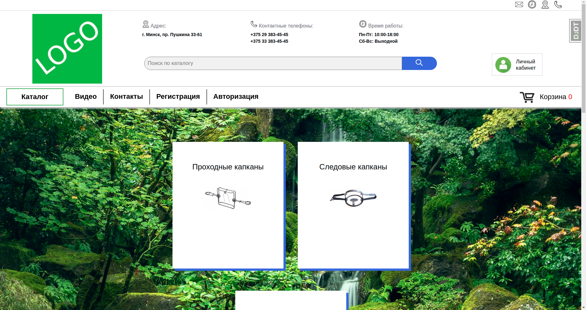

Интернет магазин с использованием Django

<h2>О проекте</h2>

Магазин выполненный на Django версии 3.1.8, python 3.8.5.
С HTML5, JavaScript и собственным CSS для Frontend, ипользуемая база данных PostgreSQL.
Магазин имеет такой функционал:

<ol>
    <li>Со стороны пользователя:</li>
    <ul>
        <li>Возможность поиска товар по названию;</li>
        <li>Возможность зарегестрироваться/авторизации на сайте;</li>
        <li>Возможность видеть свои заказы и их статус при регистрации на сайте;</li>
        <li>Возможность видеть видеть недавно посещённые товары;</li>
        <li>Возможность добовлять и удалять товары из корзины;</li>
        <li>Возможность оформлять заказ через корзину;</li>
    </ul>
    <li>Со стороны администратора:</li>
    <ul>
        <li>Возможность создать категорию;</li>
        <ul>
            <li>Возможность добавить категории фото;</li>
        </ul>
        <li>Возможность создать товар;</li>
        <ul>
            <li>Возможность добавить товару несколько фото;</li>
            <li>Возможность добавить товару ярлык NEW, ХИТ или рекоменддованно;</li>
            <li>Возможность добавить товару скидку;</li>
            <li>Возможность показывать связные с ним товары;</li>
        </ul>
        <li>Возможность добавить видео;</li>
        <li>Возможность принимать заказы и изменять их статус;</li>
    </ul>
</ol>

<h2>Backend/Frontend разработчик</h2>

<ul>
    <li>Михалькевич Алексей</li>
</ul>

<h2>License</h2>

Этот проект находится под лицензией Apache License Version 2.0
